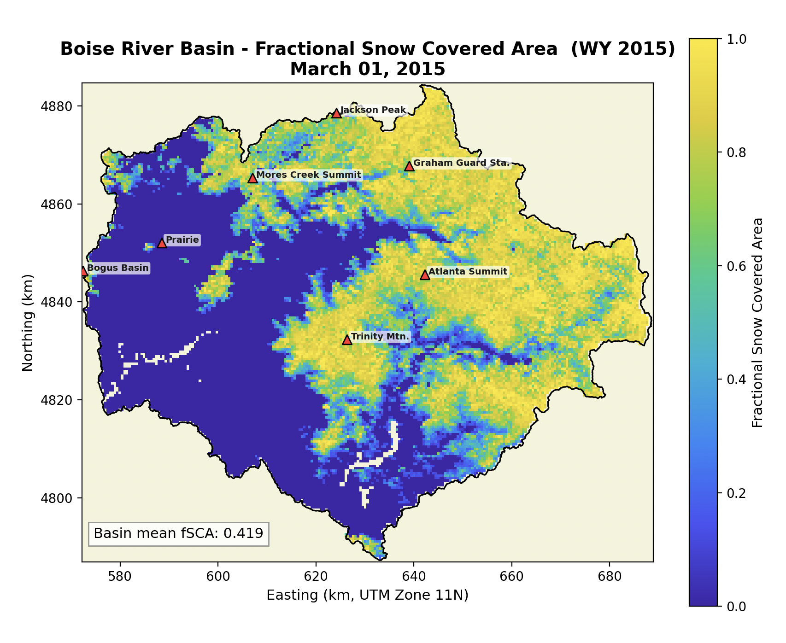

# Boise River Basin — Fractional Snow Covered Area Visualization

Tools for downloading, clipping, reprojecting, and animating SPIReS HIST V01
fractional snow covered area (fSCA) data over the Boise River Basin (BRB),
southwestern Idaho.

Both MATLAB and Python implementations are provided with identical functionality.



## Data Source

**SPIReS HIST V01** from NSIDC:

- **FTP:** `ftp://dtn.rc.colorado.edu/shares/snow-today/gridded_data/SPIRES_HIST_V01`
- **DOI:** [10.7265/a3vr-c014](https://doi.org/10.7265/a3vr-c014)
- **Format:** netCDF-4, MODIS sinusoidal projection, 500 m resolution
- **Tile:** h09v04 (covers the entire Boise River Basin)
- **Temporal coverage:** March 2000 – September 2025 (daily)
- **Variables used:** `snow_fraction` (on-the-ground, gap-filled), with
  `grain_size` as a companion for unobserved-pixel detection

**Citation:**
> Rittger, K., Lenard, S. J., Palomaki, R. T., Bair, E. H., Dozier, J. &
> Mankoff, K. (2025). Historical MODIS/Terra L3 Global Daily 500m SIN Grid
> Snow Cover, Snow Albedo, and Snow Surface Properties. (SPIRES_HIST, V1).
> [Data Set]. Boulder, CO. NSIDC. https://doi.org/10.7265/a3vr-c014

## Files

| File | Language | Description |
|------|----------|-------------|
| `plot_fsca_frame.py` | Python | Standalone single-day fSCA visualization |
| `download_clip_animate_fSCA.py` | Python | Full pipeline: download, clip, reproject, animate |
| `plot_fsca_frame.m` | MATLAB | Standalone single-day fSCA visualization |
| `download_clip_animate_fSCA.m` | MATLAB | Full pipeline: download, clip, reproject, animate |

## Requirements

### Python
```bash
pip install netCDF4 numpy matplotlib pyshp Pillow
# For MP4 output, also need ffmpeg on PATH
```

### MATLAB
- R2018b+ with Mapping Toolbox (for `shaperead`)

## Quick Start

### Python — Plot a single day
```bash
python plot_fsca_frame.py SPIRES_HIST_h09v04_MOD09GA061_20150301_V1.0.nc BRB_outline.shp
```

With a cached mask (faster after first run):
```bash
python plot_fsca_frame.py SPIRES_HIST_h09v04_MOD09GA061_20150301_V1.0.nc \
       --mask-file basin_mask_BRB_outline_h09v04.npz
```

Save to PNG:
```bash
python plot_fsca_frame.py SPIRES_HIST_h09v04_MOD09GA061_20150301_V1.0.nc \
       BRB_outline.shp --save-png march1.png
```

### Python — Full water year animation
```bash
python download_clip_animate_fSCA.py 2015 BRB_outline.shp
python download_clip_animate_fSCA.py 2020 BRB_outline.shp --format kmz --fps 15
```

### MATLAB — Plot a single day
```matlab
plot_fsca_frame('nc_file', 'SPIRES_HIST_h09v04_MOD09GA061_20150301_V1.0.nc', ...
                'shapefile', 'BRB_outline.shp')
```

### MATLAB — Full water year animation
```matlab
download_clip_animate_fSCA(2015, 'BRB_outline.shp')
download_clip_animate_fSCA(2020, 'BRB_outline.shp', 'output_format', 'kmz')
```

## Water Year Convention

The input year is interpreted as a **water year** (WY):

| Water Year | Start Date | End Date |
|------------|------------|----------|
| WY 2015 | Oct 1, 2014 | Sep 30, 2015 |
| WY 2020 | Oct 1, 2019 | Sep 30, 2020 |

## Output Formats

- **MP4** — Video animation with UTM-projected frames, basin boundary, SNOTEL stations, and daily fSCA colormap
- **KMZ** — Google Earth overlay with time-stamped transparent PNGs and SNOTEL placemarks; use the time slider to step through the snow season

## SNOTEL Stations

Eight SNOTEL stations within or near the basin are plotted as red triangles:

| Station | ID | Elevation |
|---------|-----|-----------|
| Bogus Basin | #978 | 6,370 ft |
| Mores Creek Summit | #637 | 6,090 ft |
| Graham Guard Sta. | #496 | 5,680 ft |
| Jackson Peak | #550 | 7,060 ft |
| Atlanta Summit | #306 | 7,570 ft |
| Trinity Mtn. | #830 | 7,790 ft |
| Banner Summit | #312 | 7,040 ft |
| Prairie | #700 | 5,580 ft |

## Technical Notes

### Sinusoidal-to-UTM Reprojection

MODIS data is stored in a sinusoidal equal-area projection where pixel columns
converge toward the poles. At the BRB's latitude (~43-44 N), a given sinusoidal
column is shifted ~1.75 deg west at the northern edge compared to the southern edge.
The scripts reproject to UTM Zone 11N via a nearest-neighbor lookup table:

1. Build a regular 500 m UTM output grid covering the basin
2. Inverse-project each UTM cell to lat/lon to sinusoidal to full-tile pixel index
3. Expand the netCDF read range beyond the mask bounding box to capture
   pixels that the nonlinear projection maps to
4. Test basin membership with point-in-polygon on sinusoidal coordinates
5. Resample each daily frame via the precomputed lookup table

### netCDF Dimension Order

SPIRES netCDF files store `snow_fraction(x, y, time)` where dim1=x
(sinusoidal easting = columns) and dim2=y (sinusoidal northing = rows).
MATLAB's `ncread` returns dimensions in file order; Python's `netCDF4` may
reorder them (typically `(time, x, y)`). Both implementations inspect
dimension names to slice correctly and transpose as needed.

### Mask Caching

The basin mask (point-in-polygon test for ~75,000 sinusoidal pixels) is cached
to disk after the first run (`.mat` for MATLAB, `.npz` for Python). Delete the
cached file to force regeneration if the shapefile changes.
